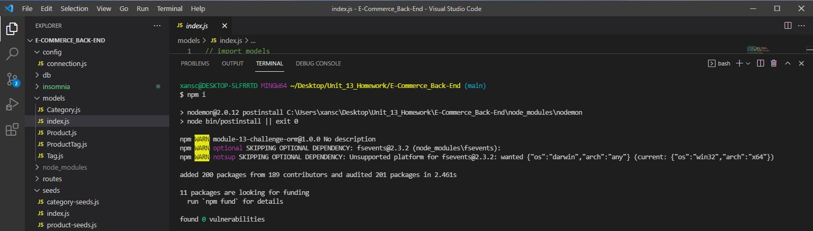
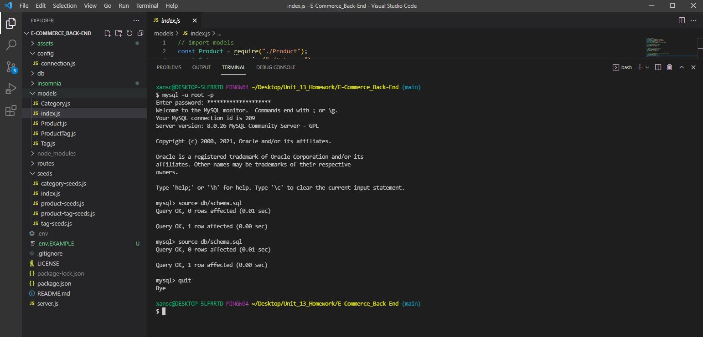
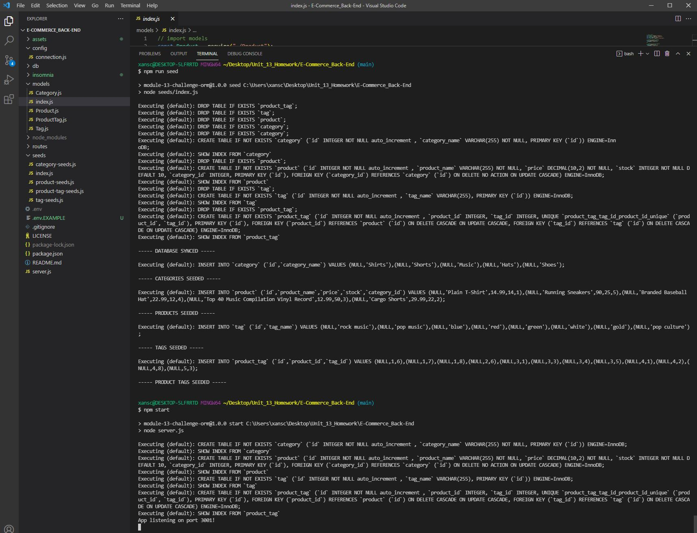

# E-Commerce_Back-End

## Description

This is an e-commerce back end project which utilizes an Express.js API with Sequelize to interact with a MySQL database. Upon setting up and starting the app the server will start and Sequelize models will sync to the MySQL database. Insomnia can demonstrate the API GET routes for categories, products, or tags, displaying their data in a formatted JSON. Likewise Insomnia can demonstrate the API POST, PUT, and DELETE routes for categories, products, and tags to successfully create, update, and delete data from the database.

## Table of Contents

1. [Description](#description)
2. [Installation](#installation)
3. [Usage](#usage)
4. [License](#license)

## Installation

First you will need to fork, then clone, the repository to your local, and make sure you're ready to use Node.js, MySQL, and Insomnia to display the results of the various routes. After doing so, open the integrated terminal in the E-Commerce_Back-End directory and in the command line enter "npm install" to install the necessary dependancies. For this app, you will need to create a .env in the app root directory. You can use the .env.EXAMPLE file by simply deleting the ".EXAMPLE" and filling in the user and password. This concludes the installation and you are ready to use the app. Below is an image of the npm install.

## Usage

After installation is complete, in the integrated terminal enter "mysql -u root -p" to log in to MySQL. You will be prompted for your password. Then enter "source db/schema.sql", you should see queries setting up the database to be used. At this point enter "quit" or "exit" to leave the MySQL shell. Next enter "npm run seed" which will seed the tables with test values. You can start the app with a "npm start". From your insomnia window you can import the Insomnia_Test_Routes from the insomnia folder and see the results of the various GET, POST, PUT, and DELETE routes. Below are images of installation and starting the app. Following these are a video briefly showing certain critical files, the process to setup and start the app, and it's functionality as demonstrated in Insomnia.

[Video of installation and usage.](https://drive.google.com/file/d/1rj_DBGnMF0_FlSwIfH0wrqoaNQTrgPwG/view)

## License

The license under which this project is covered is the MIT License. Learn more about that license [here](https://choosealicense.com/licenses/mit/).
